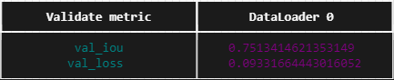

# Обучение модели сегментации FCN ResNet50

## Данные

Работаем с популярным датасетом Oxford-IIIT Pet Dataset. Он состоит из 37 классов собак и кошек, на каждый класс около 200 картинок. В датасете есть как боксы и маски. В датасете около 7 тысяч изображений.

## Результаты обучения

Обучение длилось 5 эпох, результаты на валидационной выборке:

