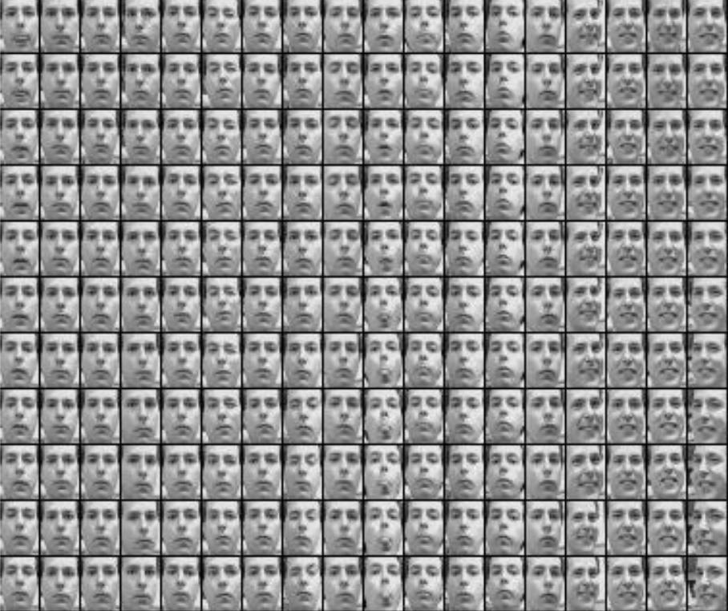

# Генерация лиц

В этой работе обучается простой вариационный автокодировщик для генерации человеческого лица.

Для этого используется датасет Frey, содержащий около 2000 монохромных изображений лица [Брендана Фрея](https://www.ece.utoronto.ca/people/frey-b/). Каждая картинка имеет высоту 28 и ширину 20 пикселей.

Примеры изображений:

