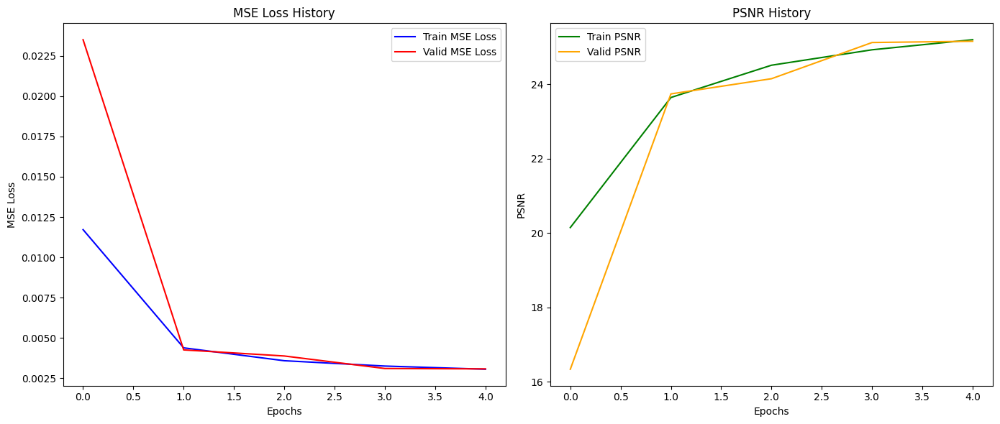
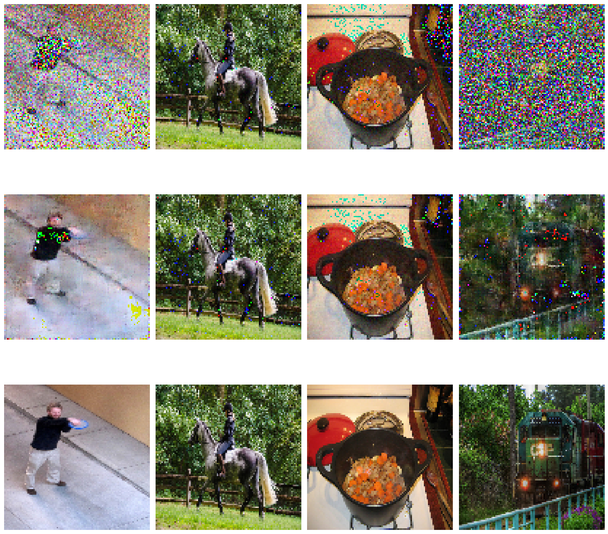
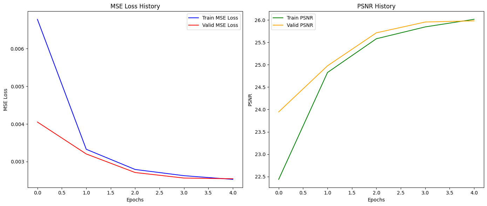
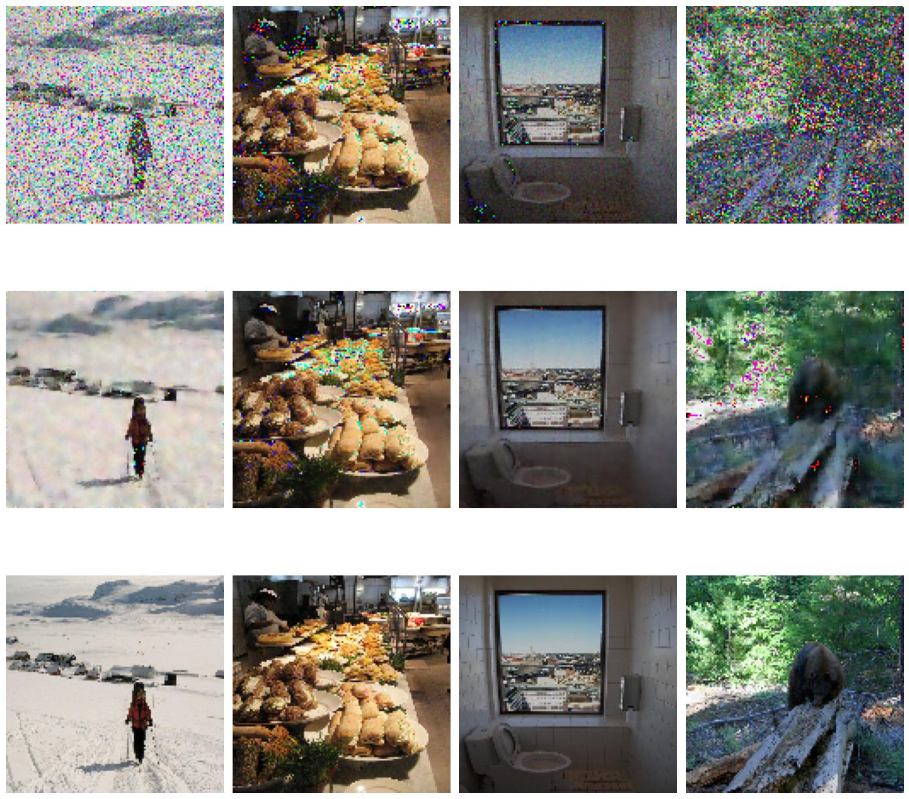

# Image denoising

В рамках этой работы происходит обучение сетей, восстанавливающих зашумленные изображения.

В качестве датасета взят [COCO 2017 Dataset](https://www.kaggle.com/datasets/awsaf49/coco-2017-dataset).

Алгоритм сетей DnCNN и Unet взят из [DPIR](https://github.com/cszn/DPIR/blob/master/README.md).

Динамика обучения DnCNN:

Тест:

Здесь на первой строке искусственно зашумленные изображения. На второй строке находятся восстановленные нашей обученной сетью изображения. И на третьей строке — чистые исходные изображения.

Динамика обучения Unet:

Тест:

