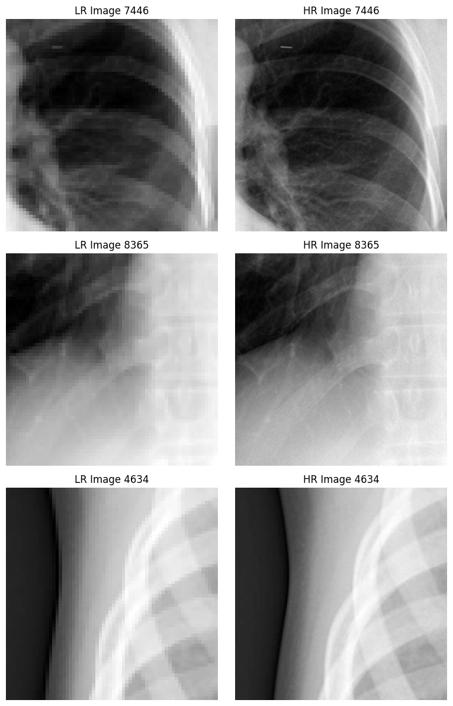
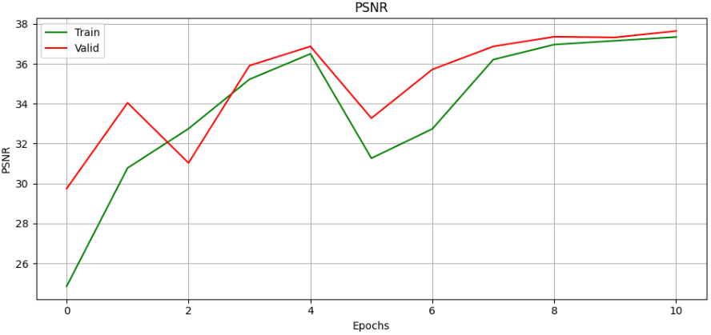
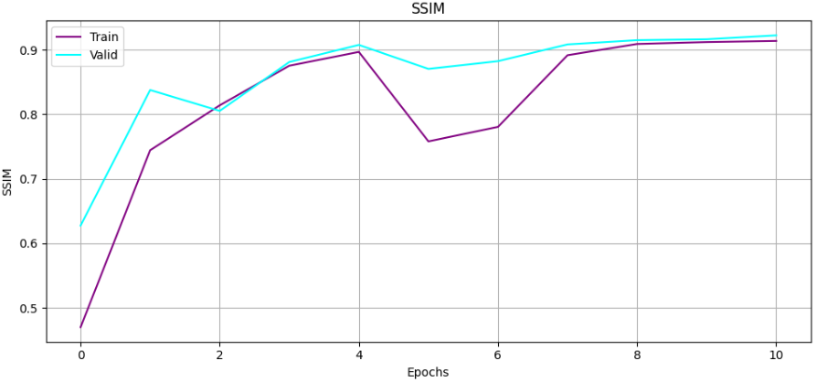

# MedSRGAN training

Пробуем обучить SR-модель для восстановления качества рентгеновских снимков.

## Данные и модель

Обучение и валидация осуществляется на данных [covid19-pneumonia-normal-chest-xray-pa-dataset](https://www.kaggle.com/datasets/amanullahasraf/covid19-pneumonia-normal-chest-xray-pa-dataset) и [chest-xray-pneumonia](https://www.kaggle.com/datasets/paultimothymooney/chest-xray-pneumonia).

Архитектура модели и функции потерь являются скромными имплементациями идей из [статьи ребят из чжуншаньского университета](https://www.researchgate.net/publication/341368145_MedSRGAN_medical_images_super-resolution_using_generative_adversarial_networks).

Чтобы обучить генератор восстанавливать детализацию, структуру исходного HR-изображения (High resolution), т.е. повышать его разрешение, можно сперва искусственно снизить качество последнего (с помощью бикубической интерполяции, например) — такие изображения помечаются как LR (Low Resolution); а затем подавать в модель получившуюся пару (LR, HR) и позволить ей считать loss-ы, подгоняться под представления модели об идеальном исходнике и воссоздавать SR-изображение (Super-Resolution).

Ниже представлены пары LR и HR изображений: получены с помщью нарезки оригиналов на квадратные экземпляры: это деалется для того, чтобы ускорить процесс обучения, расширить базу данных (аугментация: спасительный трюк при небольшом датасете) и помочь модели усваивать полезную информацию, генерализировать представления об объектах.

## Результаты

Ниже представлена динамика метрик в процессе обучения на тренировочной и валидационной выборках.

Далее — в трёх колонках представлены изображения из валидационной выборки для визуальной оценки качества обученного SR-генератора.

Какое-то улучшение всё же заметить удаётся!
