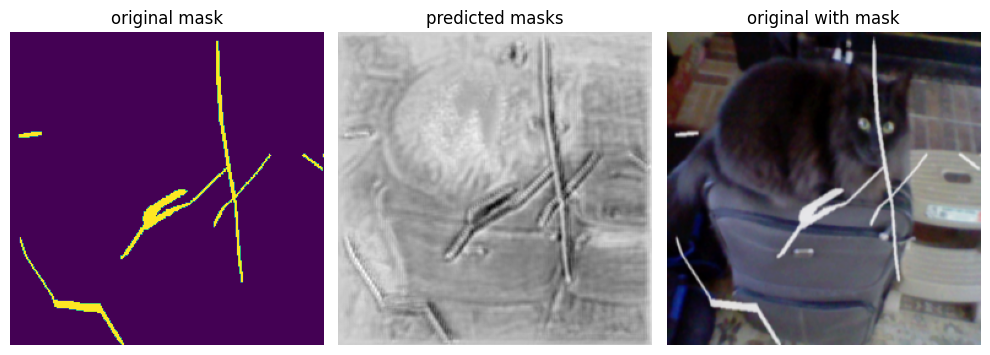

# Генерация маски дефектов

Эта работа является испытательной: здесь я использую продвинутый планировщик скорости обучения CosineAnnealingWarmRestarts, а также модифицированную функцию потерь SoftBCEWithLogitsLoss. Вместе эти инсрументы очень хорошо могут повлиять на процесс обучения.

Однако высоких результатов в задаче обучения модели для генерации масок дефектов мне получить пока не удалось: подозреваю, дело может быть в данных для обучения, в предобработке изображений, ну и, возможно, в архитектуре сети.

Использовался тот же самый датасет, что и в предыдущей работе: [COCO 2017 Dataset](https://www.kaggle.com/datasets/awsaf49/coco-2017-dataset). Получилось добавить искусственные дефекты, некоторым образом сымитировать естественные заломы и царапины на фотографиях.

Результаты, всё же, к сожалению, оставляют желать лучшего:

Но это справедливо: как видим по работе [Bringing-Old-Photos-Back-to-Life](https://github.com/microsoft/Bringing-Old-Photos-Back-to-Life) это далеко не самая тривиальная задача. В их проекте аналогичные модели тоже присутсвуют, однако они их обучали отнюдь не только на синтетических данных, но и на реальных изображениях с реальными дефекатими, как и полагается. Оправдаю себя тем, что настолько качественная работа требует куда больше времени, усилий и средств, сдобренных пропорциональной мотивацией.
