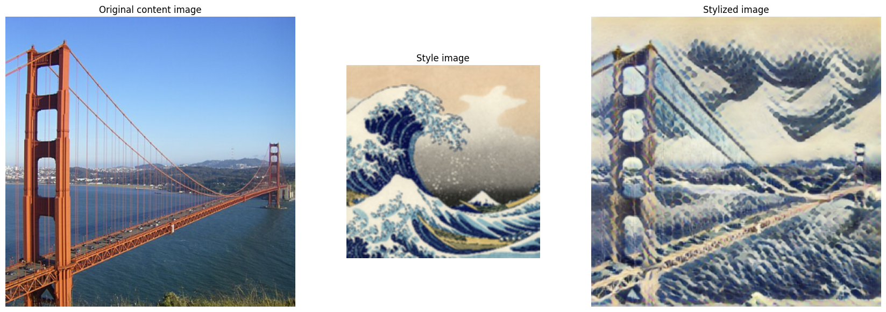
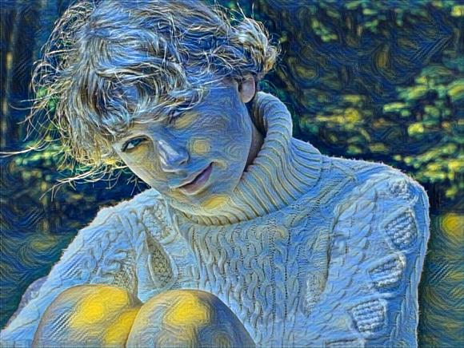

# Перенос стиля

Это один из уже классических типов задач в компьютерном зрении. Существует просто масса приложений, основанных на работе специально обученных нейросетей при давно имеющихся [решениях, построенных на хитром синтезе текстур](https://github.com/jamriska/ebsynth), — и это мы еще не упоминаем модели на трансформерах, что нынче постоянно на слуху.

В общем, эта область CV-инжиниринга давно шагнула вперед. Цель же этой работы — потрогать своими руками классические решения:

* Попробуем повторить инференс модели [этих ребят](https://arxiv.org/abs/1705.06830) на tensorflow (Огромной плюс этой модели в том, что она является *много-стилевой*, Огромный минус — ресурс модели ([репозиторий Magent-ы](https://github.com/magenta/magenta/tree/main/magenta/models/arbitrary_image_stylization)) давно заброшен).
* Обучим свою собственную простенькую модель, используя код [этого чувака](https://github.com/pytorch/examples/blob/main/fast_neural_style/README.md). Мне пришлось внести пару микроправок, чтобы обойти соответствующее число ошибок, возникающих на этапе чтения кодом команд перед запуском обучения и на этапе переноса стиля при указании желаемого размера аутпута. Из минусов: обучение на измененном мной коде не запляшет на яблочных лэптопах.

Ну да бог с ним, вот типичный результат работы первой модели:

А вот так выглядит перенос стиля на фото одной певицы с помощью модели, обученной мной на картине Ван Гога *Звездная ночь*:

