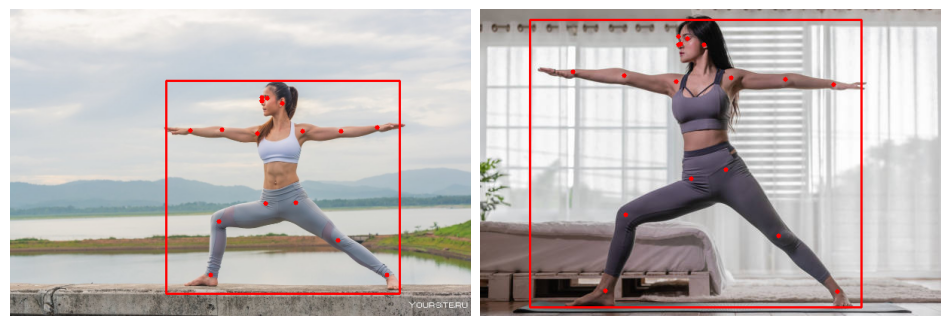
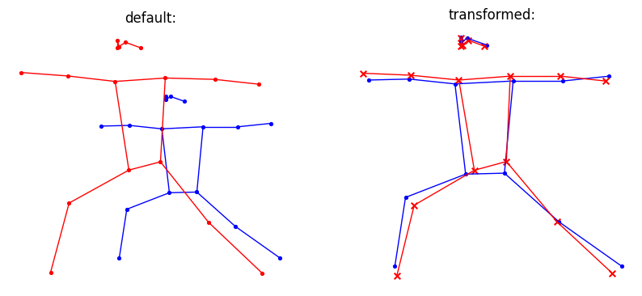
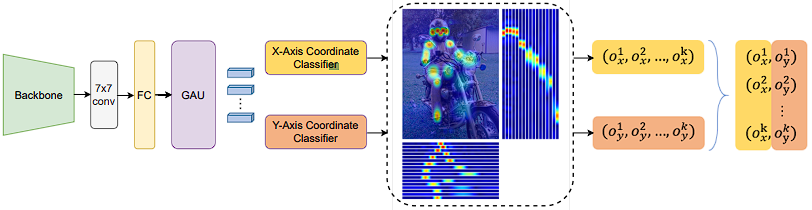
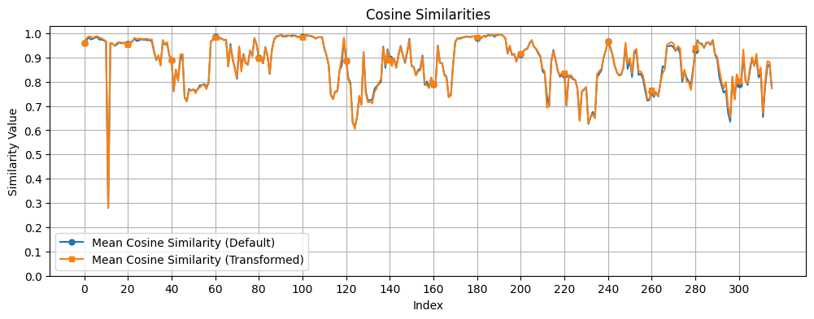

# **Виртуальный коуч**

В последние годы мы наблюдаем интересную тенденцию: люди всё чаще тренируются у себя дома. Занятия с тренером в спортзале уходят в прошлое, и на смену им приходит новая реальность, в которой люди занимаются спортом, глядя в монитор.

Но если рядом нет тренера, кто же подскажет, правильно ли выполняется то или иное упражнение?

Специально для таких случаев можно создать виртуального коуча, который поможет людям выполнять физические упражнения без вреда здоровью не будучи под присмотром живого тренера.

С помощью такого приложения пользователь сможет удостовериться в правильности и эффективности действий, просто загрузив видео со своей тренировкой. Приложение могло бы сравнить его движения с движениями тренера и выдавать полезные советы.

## Модели

В основе приложения будет лежать нейросетка, решающая задачу keypoint detection. В PyTorch, например, доступна предобученная на COCO датасете [keypoint-rcnn модель](https://pytorch.org/vision/stable/models/generated/torchvision.models.detection.keypointrcnn_resnet50_fpn.html#torchvision.models.detection.keypointrcnn_resnet50_fpn). Она вполне годится для неспешных экспериментов, т.к. R-CNN сети в принципе далеко не самые быстрые. На github-е полным-полно живых тулбоксов с также предобученными более шустрыми моделями: [YOLOv11 Pose](https://github.com/ultralytics/ultralytics), [YOLO-NAS-POSE](https://github.com/Deci-AI/super-gradients/blob/master/YOLONAS-POSE.md), [MMPose](https://github.com/open-mmlab/mmpose) ([RTMPose](https://github.com/open-mmlab/mmpose/tree/main/projects/rtmpose)), [OpenPose](https://github.com/CMU-Perceptual-Computing-Lab/openpose), [MediaPipe](https://github.com/google-ai-edge/mediapipe).

## Данные

Все вышеозначенные модели можно дообучить. Всё что нужно — размеченные данные, имеющие аннотации следующего вида:

    "annotations": [
        {
            "segmentation": [[204.01,306.23,...206.53,307.95]],
            "num_keypoints": 15,
            "area": 5463.6864,
            "iscrowd": 0,
            "keypoints": [229,256,2,...,223,369,2],
            "image_id": 289343,
            "bbox": [204.01,235.08,60.84,177.36],
            "category_id": 1,
            "id": 201376
        }
    ]

В зависимости от требований модели к данным можно рассмотреть способы приведения их общему размеру height-width.

Т.к. мы говорим об обучении нейросетей, то, разумеется, нужно обернуть данные в классы Dataset и Dataloader (отдельно для каждой из выборок — треннировочной, валидационной и/или тестовой), чтобы обеспечить последователную их трансформацию и подачу в обучающуюся модель.

## keypoint-rcnn

Поиск подходящей модели, наверное, нельзя было начать без рассмотрения наиболее доступного варианта: torchvision всегда под рукой. Здесь мы можем отточить алгоритмы преобразования результата детекции ключевых точек в нужный нам вид.

Соберём пакет из двух фото девушек, выполняющих асану "вирабхадрасана 2", и пропустим через модель. На результат наложим найденные моделью ограничивающие рамки и точки.

Далее нам нужно произвести определённые действия над векторами, соединёнными в распознанных точках, — они образуют своего рода скелет объекта на изображении. Мы хотим иметь возможность сравнивать схожесть поз людей, и этому может помешать то, как были получены изображения: сравниваемые люди могут находится на разном расстоянии от объектива камеры, под разным углом к нему. Преодолеть эту преграду для сопоставления поз нам поможет прокрустово наложение, которое в линейной алгебре можно осуществить с помощью афинного преобразования.

Далее нам не составит труда посчитать косинусную схожесть между векторами и найти среднее значение как итоговую метрику схожести поз.

### Работа с видео

Видео представляет собой поток кадров, работать с которыми мы уже умеем. Основная проблема: время обработки и выдачи результата по кадру. R-CNN архитектура, как мы уже отметили, тут склонна нас подвести. Но это не значит, что с ней мы ничего не получим:

## RTMPose

> [Общая архитектура RTMPose](https://arxiv.org/pdf/2303.07399), которая содержит сверточный слой, полносвязный слой и Gated Attention Unit (GAU) для уточнения представлений ключевых точек K. После этого оценка 2d позы рассматривается как две задачи классификации для координат осей x и y для прогнозирования горизонтального и вертикального положения ключевых точек.

Эта модель является куда более свежей, быстрой и точной. Уже существуют доступные решения с распознаванием ключевых точек людей на видео — например, проект [just_dance](https://github.com/open-mmlab/mmpose/tree/main/projects/just_dance), код из которого помог получить:

Решение построено на работе со специальным набором инструментов mmcv. Отображаемую метрику не представляется возможным интиуитивно понять с ходу, поэтому был смысл попробовать собрать собственный пайплан для получения демонстрационного образца:

Здесь нет взвешенной схожести, т.к. выход модели RTMDet-nano не содержит оценки Kpt. Но стоит выделить стабильность векторного отображения и качество отслеживания точек.

Мы можем построить график динамики косинусной схожести, чтобы выделить кадры с ошибками в движениях ученика и выдавать советы по их исправлению.

## Итог

Для реального коммерческого проекта виртуального коуча сегодня имеется довольно много полезных инструментов и почти готовых решений в свободном доступе. Модели, решающие задачу keypoint detection, можно попробовать использовать, например, для сосздания системы Video assistant referee, VAR, для спортивных проектов; для основы приложения генерации масок на лицах людей; для отслеживания действий рабочих на заводе с целью предотвращения травмоопасных случаев и для много чего ещё.

Это одна из самых потенциально прибыльных и стремительно развивающихся линеек технологий в компьютерном зрении.
